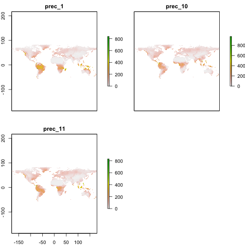

ccafs
=====


<!-- README.md is generated from README.Rmd. Please edit that file -->

[](https://cranchecks.info/pkgs/ccafs)
[](https://travis-ci.org/ropensci/ccafs)
[](https://ci.appveyor.com/project/sckott/ccafs)
[](https://codecov.io/gh/ropensci/ccafs)
[](https://github.com/r-hub/cranlogs.app)
[](https://cran.r-project.org/package=ccafs)
[](https://github.com/ropensci/onboarding/issues/82)

R client for Climate Change, Agriculture, and Food Security (CCAFS)
General Circulation Models (GCM) data.

## About CCAFS

The CCAFS-Climate data portal (<http://ccafs-climate.org/>) provides global and regional future high-resolution climate datasets that serve as a basis for assessing the climate change impacts and adaptation in a variety of fields including biodiversity, agricultural and livestock production, and ecosystem services and hydrology. CCAFS data can be used by anyone from scientists studying climate change, and how climate impacts various aspects of the earth, to companies projecting crop yields in the future. Search google scholar with `"CCAFS" "GCM"` to see example uses.

These open-access datasets are hosted by Amazon Web Services. CCAFS GCM data for this package comes from Amazon S3
[root path](http://cgiardata.s3.amazonaws.com).

As far as I can tell, CCAFS GCM data comes from IPCC data.

## About Amazon S3

Amazon S3 stands for "Simple Storage Service" - it's like a file system,
and they give you links to the files and metadata around those links.

S3 is split up into buckets, essentially folder. All CCAFS data is in
one bucket. Within the CCAFS bucket on S3 are a series of nested folders.
To get to various files we need to navigate down the tree of folders.
Keys are file paths with all their parent folders, e.g., "/foo/bar/1/2".
Unfortunately, there's no meaningful search of the CCCAFS data as they
have on their website <http://ccafs-climate.org/>. However, you can
set a prefix for a search of these keys, e.g., "/foo/bar" for the key
above.

Check out <https://aws.amazon.com/s3/> for more info.

## About the package

`ccafs` is a client to work with the data CCAFS provides via Amazon Web
Services S3 data.

The `ccafs` data has access to is the "Spatial Downscaling" data that you see
on the <http://ccafs-climate.org/data/> page. The other data sets are not
open.

## Citations

Cite CCAFS data following their guidelines at <http://ccafs-climate.org/about/>

Get a citation for this package like `citation(package = 'ccafs')` after
installing the package.

## raster

The main useful output are `raster` package objects of class `RasterLayer` or `RasterBrick` - so in general have `raster` loaded in your session to maximize
happiness.

## Install

CRAN version


```r
install.packages("ccafs")
```

Development version


```r
remotes::install_github("ropensci/ccafs")
```


```r
library("ccafs")
```

## Search

You can search by the numbers representing each possible value for
each parameter. See the `?'ccafs-search'` for help on that.


```r
(res <- cc_search(file_set = 4, scenario = 6, model = 2, extent = "global",
  format = "ascii", period = 5, variable = 2, resolution = 3))
#> [1] "http://gisweb.ciat.cgiar.org/ccafs_climate/files/data/ipcc_4ar_ciat/sres_b1/2040s/bccr_bcm2_0/5min/bccr_bcm2_0_sres_b1_2040s_prec_5min_no_tile_asc.zip"
```

Alternatively, you can use the helper list where you can reference options
by name; the downside is that this leads to very verbose code.


```r
(res <- cc_search(file_set = cc_params$file_set$`Delta method IPCC AR4`,
                  scenario = cc_params$scenario$`SRES B1`,
                  model = cc_params$model$bccr_bcm2_0,
                  extent = cc_params$extent$global,
                  format = cc_params$format$ascii,
                  period = cc_params$period$`2040s`,
                  variable = cc_params$variable$Precipitation,
                  resolution = cc_params$resolution$`5 minutes`))
#> [1] "http://gisweb.ciat.cgiar.org/ccafs_climate/files/data/ipcc_4ar_ciat/sres_b1/2040s/bccr_bcm2_0/5min/bccr_bcm2_0_sres_b1_2040s_prec_5min_no_tile_asc.zip"
```


## Fetch files

Note, files are not loaded as they can be very large


```r
key <- "ccafs/ccafs-climate/data/ipcc_5ar_ciat_downscaled/rcp2_6/2030s/bcc_csm1_1_m/10min/bcc_csm1_1_m_rcp2_6_2030s_prec_10min_r1i1p1_no_tile_asc.zip"
(res <- cc_data_fetch(key = key))
#> 
#> <CCAFS GCM files>
#>    12 files
#>    Base dir: /bcc_csm1_1_m_rcp2_6_2030s_prec_10min_r1i1p1_no_tile_asc
#>    File types (count): 
#>      - .asc: 12
```

## Load data

Can load in a single file (gives `RasterLayer`), or many (gives `RasterBrick`)


```r
cc_data_read(res[1])
#> class      : RasterLayer 
#> dimensions : 900, 2160, 1944000  (nrow, ncol, ncell)
#> resolution : 0.1666667, 0.1666667  (x, y)
#> extent     : -180, 180, -60, 90  (xmin, xmax, ymin, ymax)
#> crs        : NA 
#> source     : /Users/sckott/Library/Caches/ccafs/bcc_csm1_1_m_rcp2_6_2030s_prec_10min_r1i1p1_no_tile_asc/prec_1.asc 
#> names      : prec_1 
#> values     : -2147483648, 2147483647  (min, max)
```


```r
cc_data_read(res[1:2])
#> class      : RasterStack 
#> dimensions : 900, 2160, 1944000, 2  (nrow, ncol, ncell, nlayers)
#> resolution : 0.1666667, 0.1666667  (x, y)
#> extent     : -180, 180, -60, 90  (xmin, xmax, ymin, ymax)
#> crs        : NA 
#> names      :      prec_1,     prec_10 
#> min values : -2147483648, -2147483648 
#> max values :  2147483647,  2147483647
```

## Plot


```r
library("raster")
plot(cc_data_read(res[1:3]))
```




## Meta

* Please [report any issues or bugs](https://github.com/ropensci/ccafs/issues).
* License: MIT
* Get citation information for `ccafs` in R doing `citation(package = 'ccafs')`
* Please note that this package is released with a [Contributor Code of Conduct](https://ropensci.org/code-of-conduct/). By contributing to this project, you agree to abide by its terms.

[](https://ropensci.org)
